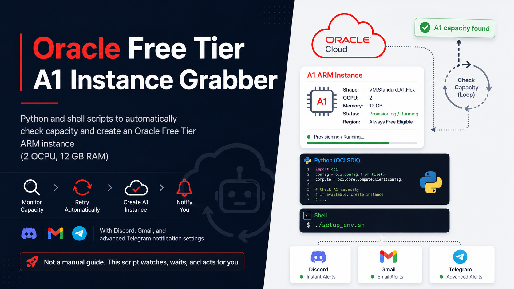

# ☁️ Oracle Free Tier Instance Creation

<p align="center">
  
</p>

<p align="center">
  <a href="https://docs.oracle.com/en-us/iaas/Content/FreeTier/freetier.htm"></a>
  <a href="https://docs.oracle.com/en-us/iaas/Content/Compute/References/computeshapes.htm"></a>
  
  
  <a href="LICENSE"></a>
</p>

Automates repeated Oracle Cloud Infrastructure instance launch attempts until capacity becomes available.

> **Free Tier capacity:** Oracle currently documents up to **4 Ampere A1 OCPUs and 24 GB of memory total** across A1 instances in an Always Free tenancy. This project's updated default request is **2 OCPUs and 12 GB RAM**, because of a discrepancy with recent news related to new Free Tier limits for A1 instance capacities. See [Oracle OCI Free Tier documentation](https://docs.oracle.com/en-us/iaas/Content/FreeTier/freetier.htm) and the [Oracle Cloud Free Tier page](https://www.oracle.com/cloud/free/).

The supported targets are:

- ARM: `VM.Standard.A1.Flex`, 2 OCPU, 12 GB RAM
- AMD: `VM.Standard.E2.1.Micro`, 1 OCPU, 1 GB RAM

The script retries according to `REQUEST_WAIT_TIME_SECS`, writes detailed logs locally, and can send notifications through email, Discord, and Telegram.

## 🧭 Contents

[How It Works](#how-it-works) · [Prerequisites](#prerequisites) · [Installation](#installation) · [Configure](#configure-the-script) · [Start](#start-the-script) · [Notifications](#telegram-notifications) · [Environment Variables](#environment-variables) · [Troubleshooting](#troubleshooting) · [References](#references)

## ⚙️ How It Works

1. Loads your OCI API credentials and instance settings.
2. Finds the requested availability domain, subnet, and image.
3. Checks whether the target instance already exists.
4. Attempts to launch the instance.
5. Waits and retries when OCI reports temporary capacity or rate-limit errors.
6. Writes instance details to `INSTANCE_CREATED` after success.

## ✅ Prerequisites

Before starting, you need:

- An Oracle Cloud account.
- An Ubuntu machine on which to run the script.
  - An existing Always Free `VM.Standard.E2.1.Micro` instance is recommended.
  - When running outside OCI, you must provide an existing subnet OCID through `OCI_SUBNET_ID`.
- An OCI API key and its configuration-file preview.

  <details>
  <summary><strong>Create an Oracle API key</strong></summary>

  1. Sign in to the [Oracle Cloud Console](https://cloud.oracle.com/).
  2. Open **Profile** in the top-right corner.
  3. Click your **email address**.
  4. Open **Tokens & Keys**.
  5. In the **API Keys** section, click **Add API Key**.
  6. Select **Generate API Key Pair**.
  7. Download the **Private Key**. Store it securely; the private key cannot be downloaded again later.
  8. Download the **Public Key** if you want to retain a copy.
  9. Click **Add**.
  10. Copy the complete **Configuration File Preview** shown by Oracle.

  You will use:

  - The downloaded private key as `oci_api_private_key.pem`.
  - The configuration-file preview as `oci_config`.

  The preview should look similar to:

  ```ini
  [DEFAULT]
  user=ocid1.user.oc1...
  fingerprint=...
  tenancy=ocid1.tenancy.oc1...
  region=...
  key_file=/home/ubuntu/oracle-freetier-instance-creation/oci_api_private_key.pem
  ```

  Update `key_file` so it contains the absolute path to your private key on the machine running this script.

  </details>

- The availability domain that is eligible for Always Free resources, such as `AD-1`.

## 📦 Installation

SSH into the Ubuntu machine that will run the script:

```bash
ssh ubuntu@YOUR_SERVER_IP
```

Clone this repository and enter it:

```bash
git clone https://github.com/zxcvresque/oracle-freetier-instance-creation.git
cd oracle-freetier-instance-creation
chmod +x setup_env.sh setup_init.sh
```

## 🔑 OCI Credentials

Create the private-key file:

```bash
nano oci_api_private_key.pem
```

Paste the downloaded private key, save it, then restrict access:

```bash
chmod 600 oci_api_private_key.pem
```

Create the OCI configuration file:

```bash
nano oci_config
```

Paste Oracle's configuration-file preview. Ensure `key_file` uses the correct absolute path:

```ini
key_file=/home/ubuntu/oracle-freetier-instance-creation/oci_api_private_key.pem
```

Do not commit `oci_api_private_key.pem`, `oci_config`, or populated secrets to Git.

## 🛠️ Configure the Script

Run the interactive configuration script:

```bash
./setup_env.sh
```

It creates `oci.env` and asks for the instance settings and optional notification integrations.

If `oci.env` already exists, it is backed up as `oci.env.bak`.

Review the generated file:

```bash
nano oci.env
```

At minimum, verify:

```env
OCI_CONFIG=/home/ubuntu/oracle-freetier-instance-creation/oci_config
OCT_FREE_AD=AD-1
DISPLAY_NAME=my-arm-ubuntu-instance
OCI_COMPUTE_SHAPE=VM.Standard.A1.Flex
REQUEST_WAIT_TIME_SECS=60
SSH_AUTHORIZED_KEYS_FILE=/home/ubuntu/oracle-freetier-instance-creation/id_rsa.pub
OPERATING_SYSTEM=Canonical Ubuntu
OS_VERSION=22.04
```

If you run the script outside an OCI instance, also set:

```env
OCI_SUBNET_ID=ocid1.subnet...
```

## 🚀 Start the Script

For the first run:

```bash
./setup_init.sh
```

The first run creates a Python virtual environment and installs dependencies. This can take several minutes on a small E2 instance.

The terminal prints a short result:

- Successful startup: inspect `launch_instance.log` for retries.
- Configuration error: inspect `ERROR_IN_CONFIG.log`.
- Unexpected setup/runtime error: inspect `UNHANDLED_ERROR.log`.

For later runs, skip dependency installation:

```bash
./setup_init.sh rerun
```

## 🖥️ Run Inside tmux

Start the script in a detached session named `oracle`:

```bash
tmux new-session -d -s oracle "cd ~/oracle-freetier-instance-creation && ./setup_init.sh rerun"
```

Check the session:

```bash
tmux attach -t oracle
```

Detach without stopping it by pressing `Ctrl+B`, then `D`.

Stop the session and any remaining Python process:

```bash
tmux kill-session -t oracle
pkill -f "python3 main.py" 2>/dev/null
```

Pull updates and restart using the existing configuration:

```bash
cd ~/oracle-freetier-instance-creation
git pull origin main
tmux new-session -d -s oracle "cd ~/oracle-freetier-instance-creation && ./setup_init.sh rerun"
```

## 📋 Logs

| File | Purpose |
| --- | --- |
| `setup_and_info.log` | Tenancy, availability domain, subnet, image, and setup information. |
| `launch_instance.log` | Launch attempts, retryable capacity errors, rate limits, and launch responses. |
| `ERROR_IN_CONFIG.log` | Invalid or malformed `oci_config` and configuration values. |
| `UNHANDLED_ERROR.log` | Unexpected errors that stop the script. |
| `INSTANCE_CREATED` | Details of the successfully created or detected target instance. |

Follow live launch attempts:

```bash
tail -f launch_instance.log
```

## ✈️ Telegram Notifications

### 💬 Direct Messages

1. Create a bot through `@BotFather` using `/newbot`.
2. Obtain your Telegram user ID.
3. Add the following to `oci.env`:

```env
TELEGRAM_TOKEN=your_bot_token
TELEGRAM_USER_ID=your_user_id
```

### 🗂️ Group Log Topics

Create a Telegram forum group, add the bot as an administrator, and create two topics:

- `launch_instance`: receives launch and retry logs.
- `errors`: receives configuration and unhandled errors.

Configure them in `oci.env`:

```env
TELEGRAM_LOGS_ENABLED=True
TELEGRAM_LOG_GROUP_ID=-100xxxxxxxxxx
TELEGRAM_LOG_INTERVAL_SECS=60
TELEGRAM_LOG_TOPIC_LAUNCH_INSTANCE=x 
TELEGRAM_LOG_TOPIC_ERRORS=x
```

To find IDs using `@MissRose_bot`:

- Add `@MissRose_bot` to the group and run `/id` inside a topic to get its topic ID.
- Run `/id` in the group's **General** topic to get the group ID.

Alternatively, send a message inside the topic and request:

```bash
curl "https://api.telegram.org/bot<TELEGRAM_TOKEN>/getUpdates"
```

Use the returned `message_thread_id`.

## 🔔 Other Notifications

### 🟣 Discord

Create a Discord webhook and set:

```env
DISCORD_WEBHOOK=your_discord_webhook_url
```

### ✉️ Gmail

Enable email notifications and use a Gmail app password:

```env
NOTIFY_EMAIL=True
EMAIL=your_email@gmail.com
EMAIL_PASSWORD=your_app_password
```

## 🧩 Environment Variables

### 📌 Required

| Variable | Description |
| --- | --- |
| `OCI_CONFIG` | Absolute path to the OCI configuration file. |
| `OCT_FREE_AD` | Always Free availability domain. Separate multiple values with commas. |

### 🖥️ Instance Settings

| Variable | Description |
| --- | --- |
| `DISPLAY_NAME` | Instance display name. |
| `OCI_COMPUTE_SHAPE` | `VM.Standard.A1.Flex` or `VM.Standard.E2.1.Micro`. |
| `SECOND_MICRO_INSTANCE` | Set `True` when creating the second free Micro instance. |
| `REQUEST_WAIT_TIME_SECS` | Delay between retryable launch attempts. |
| `SSH_AUTHORIZED_KEYS_FILE` | Public SSH key path. A key pair is generated if it does not exist. |
| `OCI_SUBNET_ID` | Existing subnet OCID. Required when the script cannot discover a subnet. |
| `OCI_IMAGE_ID` | Optional exact image OCID. Overrides OS name and version selection. |
| `OPERATING_SYSTEM` | Exact operating-system name used when selecting an image. |
| `OS_VERSION` | Exact operating-system version used when selecting an image. |
| `ASSIGN_PUBLIC_IP` | Set `true` to request an ephemeral public IP. |
| `BOOT_VOLUME_SIZE` | Boot volume size in GB. Minimum is 50. |

### 🔔 Notifications

| Variable | Description |
| --- | --- |
| `NOTIFY_EMAIL` | Enables Gmail notifications. |
| `EMAIL` | Gmail address used for notifications. |
| `EMAIL_PASSWORD` | Gmail app password. |
| `DISCORD_WEBHOOK` | Discord webhook URL. |
| `TELEGRAM_TOKEN` | Telegram bot token. |
| `TELEGRAM_USER_ID` | Telegram user ID for direct notifications. |
| `TELEGRAM_LOGS_ENABLED` | Enables Telegram group log forwarding. |
| `TELEGRAM_LOG_GROUP_ID` | Telegram forum group ID, normally beginning with `-100`. |
| `TELEGRAM_LOG_INTERVAL_SECS` | Interval used to batch launch logs before sending them. |
| `TELEGRAM_LOG_TOPIC_LAUNCH_INSTANCE` | Topic ID for launch and retry logs. |
| `TELEGRAM_LOG_TOPIC_ERRORS` | Topic ID for configuration and unhandled errors. |

## 🩺 Troubleshooting

### 🚫 `Permission denied` when running a script

```bash
chmod +x setup_env.sh setup_init.sh
```

### ⏳ First run appears stuck

Dependency installation can be quiet for several minutes. Check the active processes from another SSH session:

```bash
ps -ef | grep -E "setup_init|python3|pip|apt|dpkg" | grep -v grep
```

### 🔑 OCI configuration error

Inspect:

```bash
cat ERROR_IN_CONFIG.log
```

Compare `oci_config` with `sample_oci_config` and verify the absolute `key_file` path.

### ⚠️ Unexpected runtime error

Inspect:

```bash
cat UNHANDLED_ERROR.log
```

Then restart without reinstalling dependencies:

```bash
./setup_init.sh rerun
```

## 📝 Notes

- Existing logs are removed when `setup_init.sh` starts.
- ARM instances are requested with 2 OCPU and 12 GB RAM.
- Assigning a public IP is controlled by `ASSIGN_PUBLIC_IP`.
- Capacity availability is controlled by Oracle; retries do not guarantee immediate creation.

## 🔗 References

- [Oracle OCI Free Tier documentation](https://docs.oracle.com/en-us/iaas/Content/FreeTier/freetier.htm)
- [Oracle Cloud Free Tier](https://www.oracle.com/cloud/free/)
- [Oracle Launch Instance API](https://docs.oracle.com/en-us/iaas/api/#/en/iaas/20160918/Instance/LaunchInstance)
- [Oracle LaunchInstanceDetails](https://docs.oracle.com/en-us/iaas/api/#/en/iaas/20160918/datatypes/LaunchInstanceDetails)
- [Original capacity automation article](https://hitrov.medium.com/resolving-oracle-cloud-out-of-capacity-issue-and-getting-free-vps-with-4-arm-cores-24gb-of-a3d7e6a027a8)

## 🙏 Credits

Originally created by [mohankumarpaluru/oracle-freetier-instance-creation](https://github.com/mohankumarpaluru/oracle-freetier-instance-creation).
